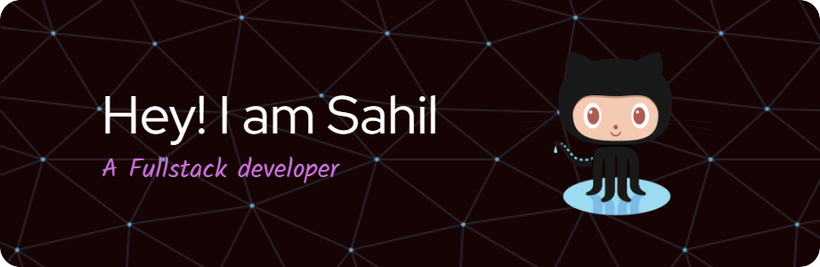

# Hi, I'm Sahil! 👋

I'm a student with a passion for software development. \
I'm always looking for new ways to learn and grow, and I'm excited to share my work with the world.

## 🚀 About Me
I am a third year B.tech student at GHRCE Nagpur , India. \
Apart from that I am a full-stack developer
who loves reading articles (on software development,  Productivity and practices) and contributing to open source.

##
👩‍💻 I'm currently working on *[BlogVilla](https://github.com/sahil-wadhai/BlogVilla/)*

🧠 I'm currently learning **FastApi**

👯‍♀️ I'm looking to collaborate on **Web development projects**

🤔 I'm looking for help with **API development**

💬 Ask me about **React, python, javascript and DSA**

📫 How to reach me wadhai.sahil101@gmail.com

😄 Pronouns "He" , "Him"

⚡️ Fun fact **"I am full time learner"**

## 🔗 Connect with me :

## 🛠 Skills

### DSA :

### Frontend :

### Backend :

### Other :

## Stats

